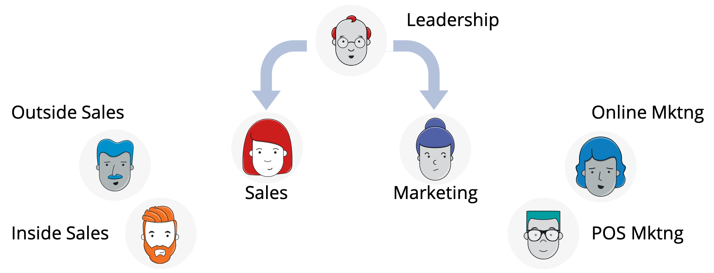

# The basics of leadership and communication

Groups are made up of people. People need to communicate with each other, and within every group, some type of leadership structure needs to exist. Let’s look at the common elements of leadership and communication within each of the structures we’ve talked about. The interpersonal dynamics of each structure will be defined by elements of leadership and communication.

### Line of Authority

Line of authority \(or chain of command\) that defines who reports to whom within each organizational structure. This is the bedrock element of all organizational structures.

The line of authority can be short \(a flatarchy is the shortest of all\), or it can be pretty lengthy \(such as within large divisional and geographic structures\).

### Span of Control

Span of Control, or the ratio of subordinates to superiors.

The higher the ratio of subordinates to superiors, the wider the span of control.

#### Centralized control

If decision-making power is concentrated at a single point, the organizational structure is centralized.

#### Decentralized control

If decision-making power is spread out, the structure is decentralized.

### Specialization

Another structure for decision-making is based on specialization - both high and low.

#### High Specialization

A high specialization division of labor can be beneficial for an organization, as it allows employees to become “masters” in specific areas, increasing their productivity as a result.

#### Low Specialization

However, low specialization allows for more flexibility, as employees can more easily tackle a broader array of tasks \(as opposed to being specialized for a single task\).

### Formality of communications flows

The next aspect of leadership and communication is whether or not the organization has decided to make the _flow_ of communications formal or informal.

#### Formal communications

A formal organizational structure seeks to separate the individual from the role or position, as the role or position stays the same regardless of who’s holding it.

#### Informal communications

An informal organization, on the other hand, places more value on the individual.

It allows for the evolution of a role or position based on an individual’s preferences, skill set, etc., and places less importance on what team or department that individual is part of.

### Departmentalization

How siloed an organization has become will affect its ability to communicate.

#### Formal departmentalization

If an organization has rigid departmentalization, each department or team is highly autonomous, and there is little \(or no\) interaction between different teams.

#### Loose departmentalization

In contrast, loose departmentalization entails that teams have more freedom to interact and collaborate.

