# Understanding organizational structures

Organizational structure is a “system that consists of explicit and implicit institutional rules and policies designed to outline how various work roles and responsibilities are delegated, controlled and coordinated. Organizational structure also determines how information flows from level to level within the company.

In other words, the structure is developed to establish how the organization operates and executes its goals. Which leaves us with a whole raft of organizational structure types.

Depending on who you are reading, there are anywhere from 4 to 9 basic organizational structures. We’ll go through them alphabetically.

### Customer or Market-Focused structure

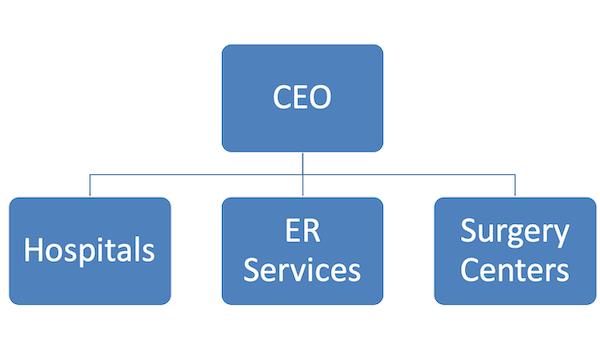

Certain industries will organize by customer type. This is done in an effort to ensure specific customer expectations are met by a customized service approach.

An example of this would be in healthcare. A patient seen as an outpatient has very different needs than those of patients who spend time in the hospital as inpatients. A customer-centered structure creates customized care for those patients. 

### Divisional-Focused structure

Larger companies that operate across several horizontal objectives sometimes use a divisional organizational structure. Under this structure, each division essentially operates as its own company, controlling its own resources and how much money it spends on certain projects or aspects of the division.

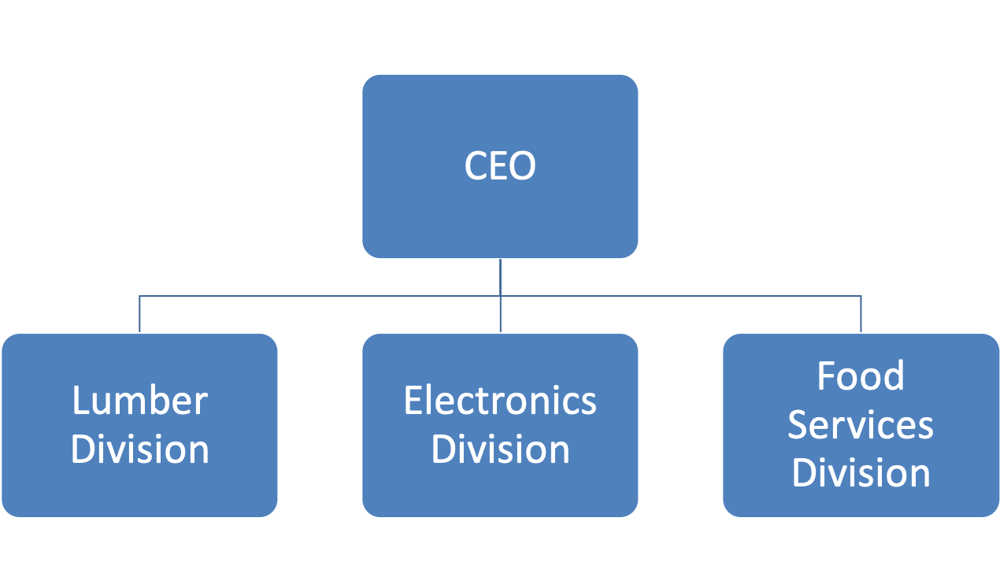

Organizations that use a traditional divisional structure rely on a vertical chain of command \(hierarchy\) as the prime method of organizing employees and their responsibilities. Military, government, and other very large organizations use a hierarchy to determine the level of control employees have over their work as well as their rank relative to others.

#### Divisional Geography-Focused structure

Additionally, within this structure, divisions could also be created geographically, with a company having divisions in Freedonia, Upper Slobovia, Lower Slobovia, etc.

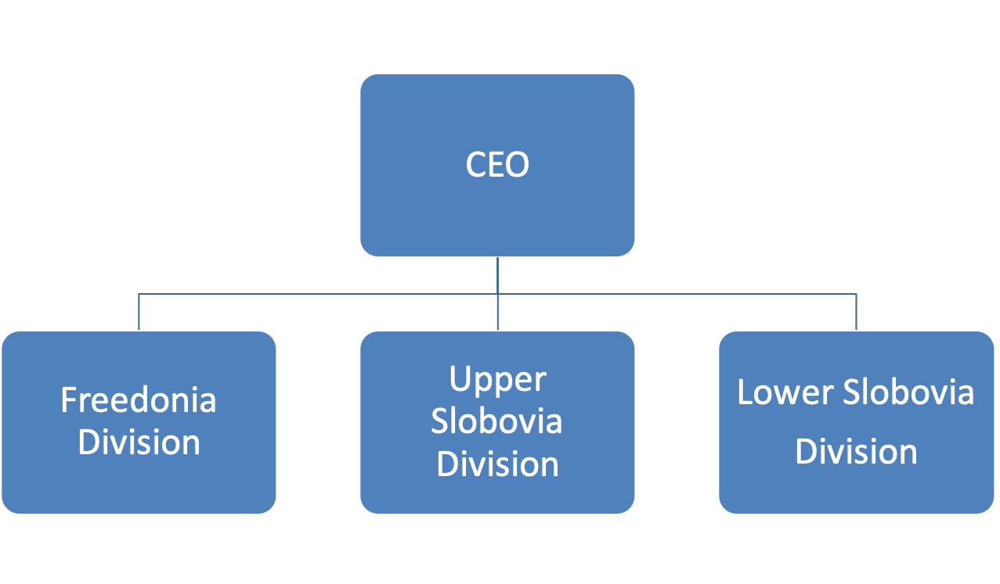

#### Divisional Market-Focused structure

Another variety of the divisional organizational structure is the market-based structure, wherein the divisions of an organization are based around markets, industries, or customer types.

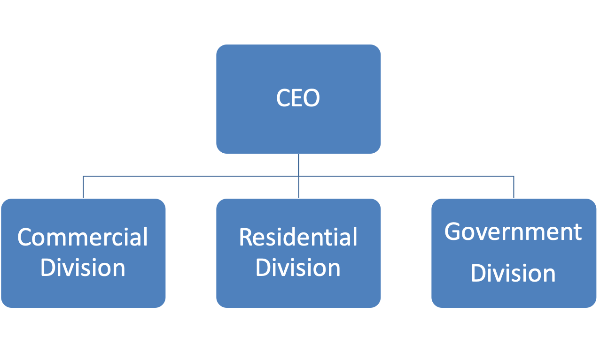

#### Divisional Product-Focused structure

Yet another common structure is to be organized by a specific product type. Each product group falls within the reporting structure of an executive and that person oversees everything related to that particular product line.

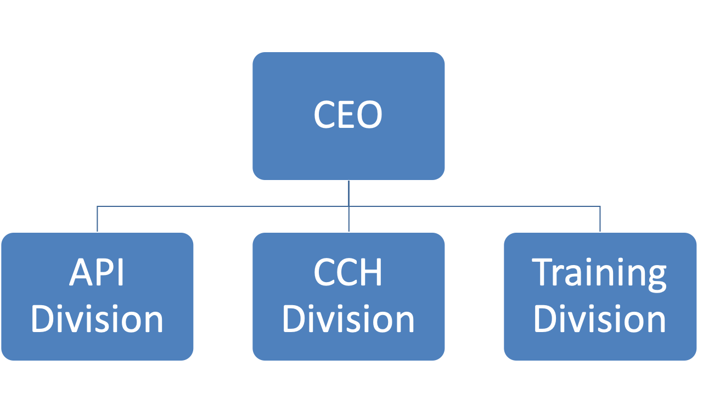

### Circular structure

While it might appear drastically different from the other organizational structures, the circular structure still relies on hierarchy, with higher-level employees occupying the inner rings of the circle and lower-level employees occupying the outer rings.

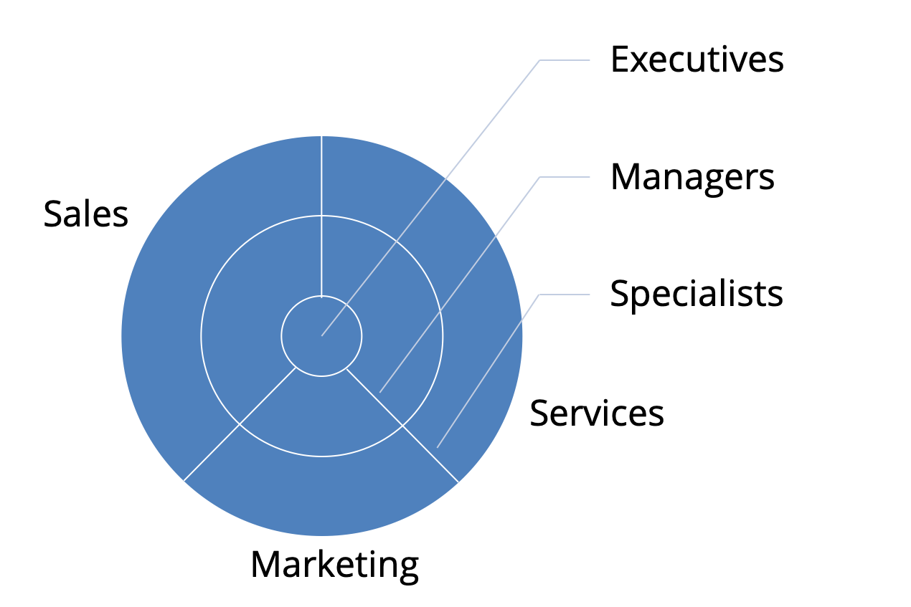

That being said, the leaders or executives in a circular organization aren’t seen as sitting atop the organization, sending directives down the chain of command. Instead, they’re at the center of the organization, spreading their vision outward.

### Flatarchy structure

Blending a functional structure and a flat structure results in a flatarchy organizational structure, which allows for more decision making among the levels of an organization and, overall, flattens out the vertical appearance of a hierarchy.

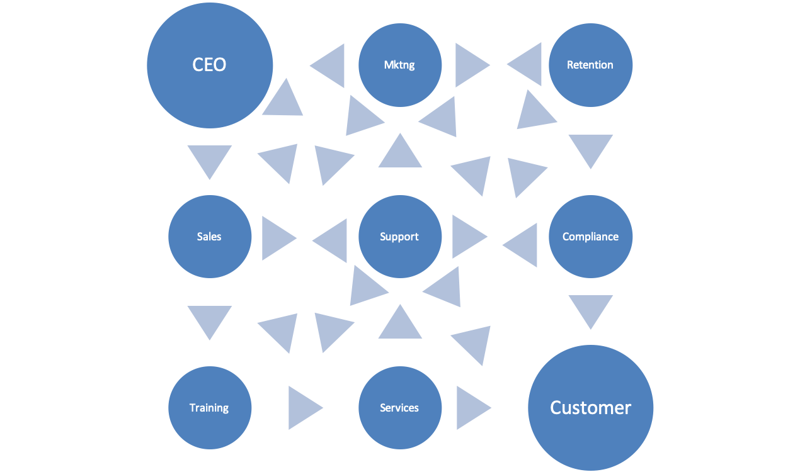

The best example of this structure within a company is if the organization has an internal incubator or innovation program. Within this system, the company can operate in an existing structure, but employees at any level are encouraged to suggest ideas and run with them, potentially creating new flat teams.

### Functional structure

The functional structure is based on an organization being divided up into smaller groups with specific tasks or roles. Common departments such as human resources, accounting and purchasing are organized by separating each of these areas and managing them independently of the others.

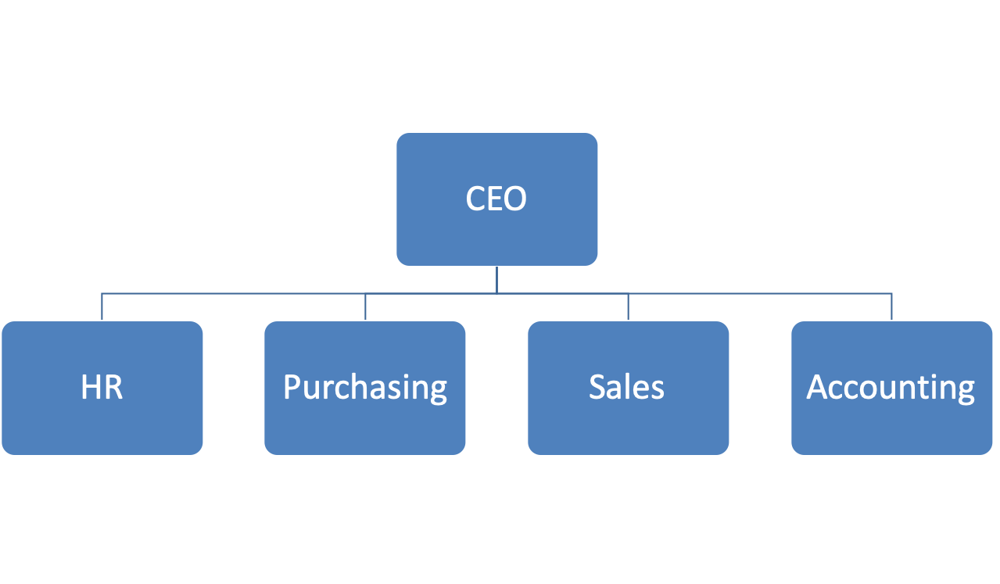

Each department has a manager or director who answers to an executive a level up in the hierarchy who may oversee multiple departments. One such example is a director of marketing who supervises the marketing department and answers to a vice president who is in charge of the marketing, finance and IT divisions.

### Matrix structure

This is a blend of the functional organizational structure and a productized or projectized organizational structure. In the matrix structure, employees may report to two or more bosses depending on the situation or project. A matrix structure provides for reporting levels both horizontally as well as vertically. Employees may be part of a functional group \(i.e. engineer\) but may serve on a team that supports new product development \(i.e. new album\). This kind of structure may have members of different groups working together to develop a new product line.

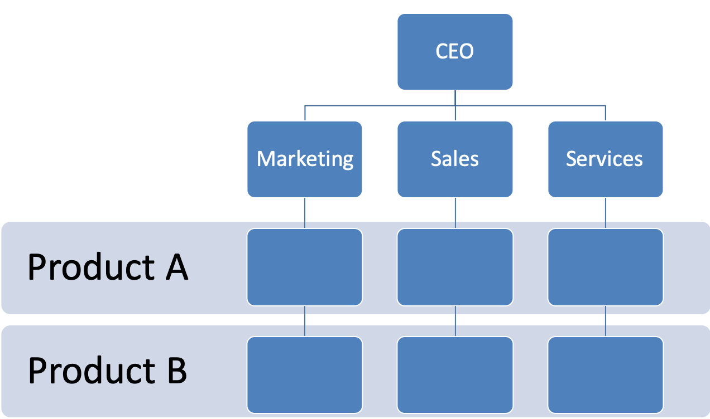

For example, under normal functional circumstances, an engineer at a large engineering firm could work for one boss, but a new project may arise where that engineer’s expertise is needed. For the duration of that project, the employee would also report to that project’s manager, as well as his or her boss for all other daily tasks.

### Network structure

A network structure is often created when one organization works with another to share resources – or if one organization has multiple locations with different functions and leadership. You might also use this structure to explain workflows if much of the staffing or services is outsourced to freelancers or multiple other businesses.

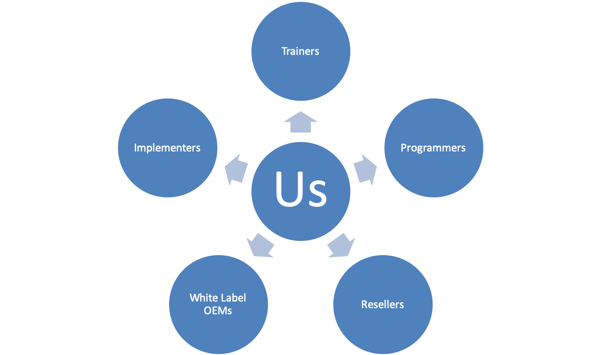

The structure looks nearly the same as the Divisional Structure. However, instead of offices, it might list outsourced services or satellite locations outside of the office.

### Process-based structure

Process-based organizational structures are designed around the end-to-end flow of different processes, such as “Research & Development,” “Customer Acquisition,” and “Order Fulfillment.”

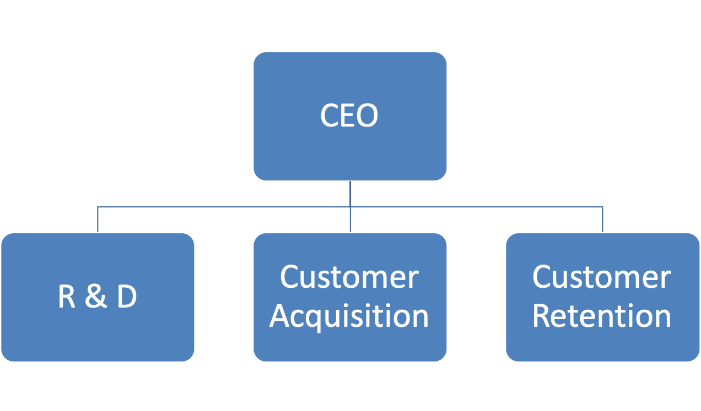

Unlike a strictly functional structure, a process-based structure considers not only the activities employees perform, but also how those different activities interact with one another.

