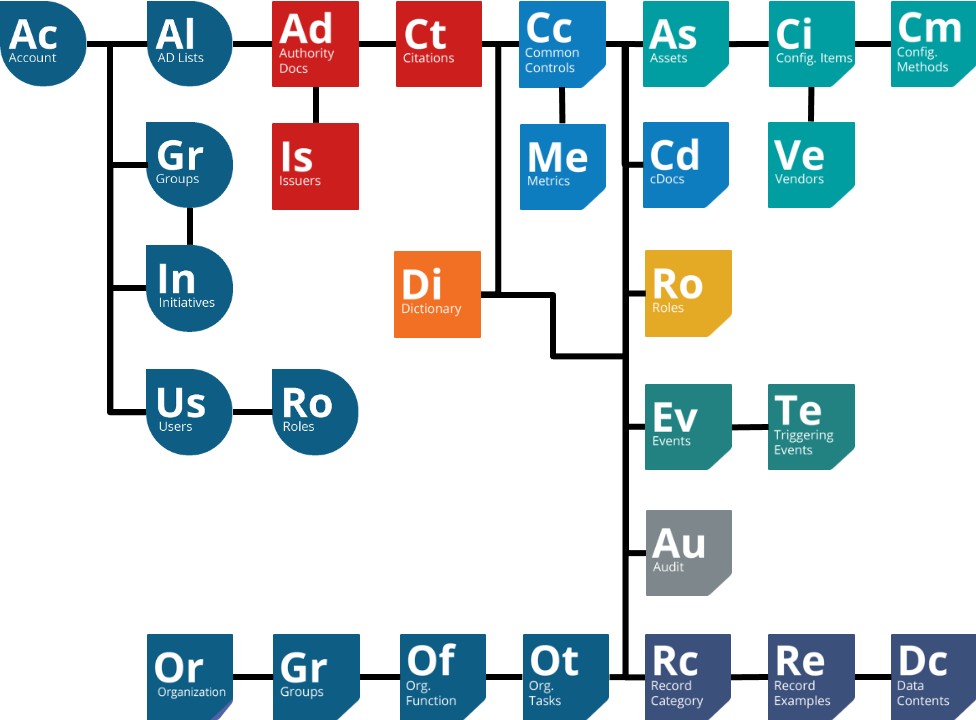
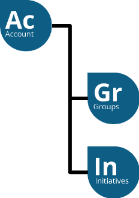
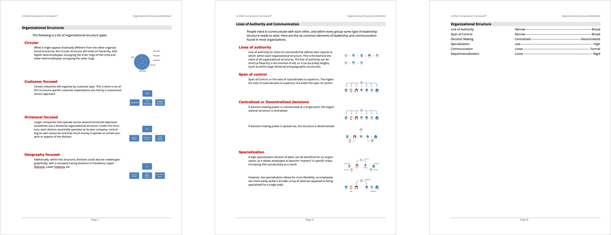
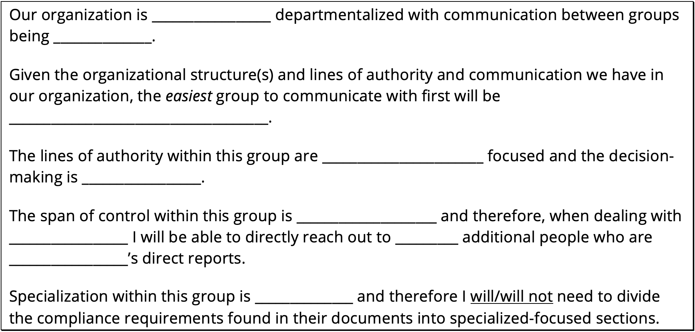

# Why you should care about this

We care, you should care, because those are the cornerstone of your Governance, Risk, and Compliance program. If you don’t understand your organization, how will you understand which parts of which Authority Documents apply to your organization’s situation and which don’t?

This illustration below represents a data diagram structure for a Unified Compliance program – each of the objects is an element within the program.

The top left of that structure represents your account (your organization) and your groups and initiatives.

We’ve created a worksheet for you to use in order to create your initial compliance strategy, shown below (and a survey to do the same thing online, [HERE](https://edu.unifiedcompliance.com/orgstructures/)). You can download the docx version of the worksheet below.



You can use this worksheet, as we stated above, to create your compliance plan, a blank template of which is shown below:

You’ll want to use that as the starting point for your compliance communication plan.
