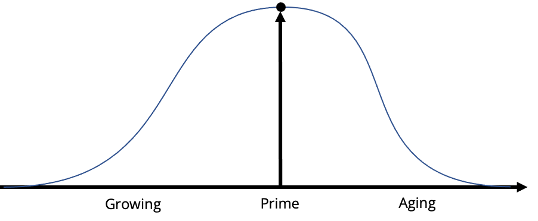
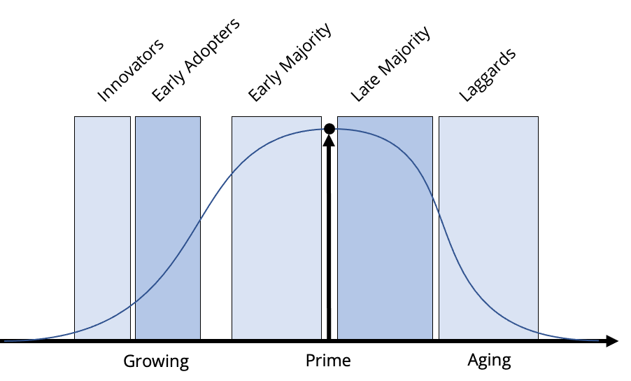

# Organizational Structures 401

All organizations are different in at least _some_ facet. However, the **major** facets of differences can be found in the maturity of their leadership types.

For our purposes, we’ll examine the differences in organizational leadership types \(which affect power and norms\) and how those types affect acceptance of change within their control environment. \(Change is never, ever, seen as a good thing – no matter what anyone says.\)

Leadership has to be established in order to create high-level objectives for the organization. Within any organization, the act of leading, or governing, is broken down into several various aspects:

* how power is exercised,
* how the users are given a voice in the process \(or not\),
* how decisions are made \(and conflicts brought to resolution\) on issues that concern all of those involved,
* how those decisions become policy within the organization, and
* how those policies and the actions of the staff are monitored.

Arranged more simply, leadership or governance addresses three basic issues of “what,” “who,” and “how.”

1. What decisions need to be made?
2. Who should make those decisions?
3. How will the decisions be made and monitored?

What decisions need to be made, who makes those decisions, and how they are made and monitored is decided by the type of leadership in effect within the organization. The power to lead or govern is dictated by the structure of the organization in all instances. Because there are many types of organizations and each organization lies somewhere along the path between its birth and its death, we’ll examine the spectrum along this bell curve of organizational development, shown below:

### The bell curve of growing and dying

Contrary to popular belief, “the wave” wasn’t originated at a Bears football game. The fist historian to document the stages and styles of history as a wave-like form was Oswald Spengler back in 1926 when he wrote the following:

> Over the expanse of the water passes the endless uniform wave-train of the generations… But over this surface, too, the great cultures accomplish their majestic wave-cycles. They appear suddenly, swell in splendid lines, flatten again and vanish, and the face of the waters is once more a sleeping waste.

This same thought pattern was picked up by the great historian Alfred Toynbee wherein he wrote about the successive rises and falls of the primary and secondary civilizations as an example of the same type of rhythm that moves towards a goal much as a wave moves toward the shoreline. In 1986 Arthur Schlesinger picked up the same rhythmic theme when focusing on American history. However, there’s one important \(at least for us\) point that Schlesinger made. Unlike the cycles of civilization that built upon each other’s understand to create forward movement \(as Toynbee pointed out\), Schlesinger’s waves of motion are merely repetitive. Schlesinger argues that there is a continuing shift “between public purpose and private interests.” As you’ll see in our arguments here, that theory fits the corporate wave-cycle like a glove. Roughly within the same time period that Schlesinger was writing about the cycles of American history and Paul Kennedy was writing the same thing about the rise and fall of great national powers, Ichak Adizes and Lawrence Miller were penning the same wave-form theories about organizations. A few years later, William Bridges added his material to the topic. Each author made this point in developing their materials – the leadership style of the organization is tied to the organization’s point in the growth cycle. And finally, at roughly the same time Geoffrey Moore was writing the bible for bringing technological products into different markets – which we’ll be using as an intrepreneurial guideline for our purposes. We’ll begin with Geoffrey Moore’s vision of the bell curve. In his Crossing the Chasm, he divides the bell curve into five main categories of organizational development; the innovators, early adopters, early majority, late majority, and laggards. 

We are going to use Moore’s five divisions to elucidate the different leadership types found in Adizes’, Miller’, and Bridges’ material.

