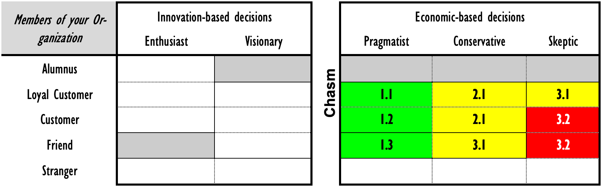

# Rolling out your communications plan

Have you ever had some idiot send you a direct mail marketing piece that assumes you are good friends - even if you’ve never heard of the person? Since my first name is Dorian, I often get mass mail directed to “Ms” Dorian Cougias (even though I’m a 6’1”, former paratrooper!). Don’t you hate that? Well, guess what – you aren’t the Lone Ranger.

Your ability to communicate with those around you stems, in part, with understanding what types of acceptance level they are willing to grant you. You must format a piece of information one way for a good friend, and a wholly different way for a complete stranger. This is because people grant a certain level of acceptance to those that they don’t know, and a greater level of acceptance to those that they do know. Another way of saying this, is that people give you different levels of permission when you communicate with them. The more they accept you, the more permission you must ask things of them and communicate in a closer personal style.

## The Customer Acceptance Level

This type of customer acceptance level has been defined as a part of Seth Godin’s consumer growth cycle outlined in his book Permission Marketing. It is broken down into five distinct categories, all measured by how accepting each of the categories would be to being approached by the person or company in question.

### Strangers

These are people that you will have to interrupt in order to gain their attention. They are not used to hearing from you and will tend to either ignore your initial requests or hold them in disdain because they are interruptive in nature. Your initial chance of success with a stranger is about 2 - 6%.

### Friends

A friend is someone who you have a passing acquaintance with. You may feel free to contact this person with an interruptive type of message, if the message is brief, to the point, and trades something for the person’s time.

### Customers

A customer is someone with whom you have already had regular business relations. They welcome your call and are not interrupted by an e-mail or other offering from you. While not as fully integrated or “on board” with anything you’d cook up as a loyal customer would be, you have served them well and have been courting them for some time.

### Loyal Customers

These are folks that you’ve “been around the block with” so-to-speak. The loyal customer can and should act as a lead bowling pin to help knock over others in any new market niche strategy. You have earned their respect and earned the privilege of asking for their assistance in new ventures.

### Former Customers (an Alumnus)

If you do it right, your former customers will remember how you helped them, and will be just as loyal (if not more so because time tempers memories for the good) as your loyal customers.

Keep them in the loop with what you are doing, and they will more than likely become customers again when the need arises and you have products that match those needs. Asking their ad-vice will keep you close to them.

## How to use this information when rolling out policies and procedures

Now it comes time to introduce your new policies and procedures to your organization. What you’ll want to do is to take a strategic approach to which folks you’ll be introducing them through.

When introducing an update to your compliance plan with new policies and procedures within the organization, you’ll be able to go directly after the pragmatist market. Remember, pragmatists want improved processes. So by starting with an evolutionary improvement to your compliance plan, you’ll be selling to their comfort factor.

The steps that you’ll want to run through can be divided into three different communications stages as shown in the diagram that follows. The basic strategy is to lead with the pragmatists and get their blessing first. Then, you’ll extend communications of the policies and procedures out to the conservatives in the organization. With each group’s blessing in hand, you’ll extend the communications one more time to the skeptics, hoping to sway them by sheer force of having the rest of the groups approve the policies and procedures first.

### 1.1 Communicating with your loyal pragmatist customers

The first stage is to sell the benefits of the addition of new policies and procedures to the compliance framework to the loyal customers that you have. Most, if not all, of the members of this group should have been involved from an early point and will have had a hand in the creation, or at least editing, of these policies and procedures. Therefore, it should be clear sailing for approval and acceptance of your polices and procedures.

Because this is to the leadership, and this is the first group you are communicating with, you’ll want to deliver the information in person with an “executive briefing.” Be sure to have the talk-ing points cards on hand so that you can give them to the executives and have them start passing the word for you.

They will tell you the best way to communicate with the rest of their group.

### 1.2 Communicating with pragmatist customers

The second stage is to communicate the new policies and procedures to the pragmatists that you’ve been working with. Because they are customers of your policies and procedures, you should have been keeping them in the loop about the progress of the policies and procedures. So this shouldn’t be new to them and there should be no acceptance issues.

Your communications tactics should include an informal meeting with the leaders and then re-quest a team meeting with their teams to communicate the policies and procedures with the entire team. This will be your first in person training event and you should have someone record the questions that are being asked when you present the policies and procedures. You’ll be able to use those questions in the next step when communicating outside of your comfort zone. You may also want to incorporate these questions into your Frequently Asked Questions (FAQ) documents.

### 1.3 Communicating with pragmatist friends

Your third stage of communication will be with people who are not customers of your policies and procedures, but who also have to be consulted or informed of them. Because this is the first time you are communicating with staff that you haven’t been actively working with, you’ll want to ensure that you only communicate with the pragmatists and not conservatives or skeptics.

Why? Because these policies and procedures will be more “new” to them than to others and they will have more reservations about them than the people you’ve been working with so far. Because you are on friendly terms with them, you’ll be able to leverage the answers you’ve developed to earlier questions during your other two briefings. If the answers you have fit the questions they bring up, you know you are on the right track. If the answers don’t fit, at least you’ll have a friendly audience to work through the issues with.

Therefore, your communication tactics with this group should also be an in-person briefing for any leaders first, followed by a team meeting. If you can’t answer the questions of the leader, you aren’t ready for the team.

Because these are people who have been outside of the communications loop until now, you will more than likely have a lot more questions and issues than before. Again, have someone record all of the issues and their answers as you’ll need those answers to help your case with the conservatives.

### 2.1 Communicating with conservative customers and loyal customers

Remember that the conservatives are all about control and reining in technology. When you present to them, you’ll want to be up front with all of the questions and answers to this point, not only briefing them on the policies and procedures at hand, but also the issues that have been raised and addressed.

The best method I’ve found when addressing conservative customers is to bring up the matter of new policies and procedures as an “update” to the current compliance books or manuals. Bringing along a printed copy of the policies and procedures, along with the FAQs you’ve been devel-oping will make your presentation to this group much more powerful.

Because they are going to be reluctant to allowing you a team meeting or access to their groups at all, you’ll have to give them a choice of delivery. My suggestion is to have your earlier briefings turned into a mini training plan that can be delivered through a recorded PowerPoint presentation or recorded webcast that their staff can view at their leisure. After a couple of weeks of them ignoring even watching something recorded, you can come back and be more forceful about formal training.

If there are questions or issues that arise from this group (other than snoring), you’ll want to add them to your FAQs.

### 3.1 Communicating with conservative friends and loyal customer skeptics

Before you communicate with these groups, wait for at least one or two members of the previous group to move through the presentation or watch the recorded webcast. Once you know which format the previous group has taken to, you can offer that as the primary means of communicating the policies and procedures with these two groups.

By now, your policies and procedures will also be posted to your intranet site and should also be inculcated into your newsletters and discussion boards. Therefore, you can communicate the “obvious acceptance” the rest of the group has taken to the new policies and procedures.

### 3.2 Blocking the two remaining skeptic segments

The last two groups’ focus will be on blocking their complaints. You’ll need to rely heavily on your FAQs and the inculcation of the message for these new policies and procedures. If a great gnashing of teeth happens with these groups, you might want to call for a meeting of the most vocal people and work through the issues with them in person.

### 3.3 Everyone else

My suggestion is to send out an e-mail to everyone else affected after you’ve dealt with the previous group. By now, every issue that can come to the surface should already be there, and you won’t be blind-sided by anything that comes back through the e-mail channel. Consider also sending a hardcopy memo so those technology-adverse folks will at least get comfort from hold-ing an old-fashioned paper communication in their hands.
