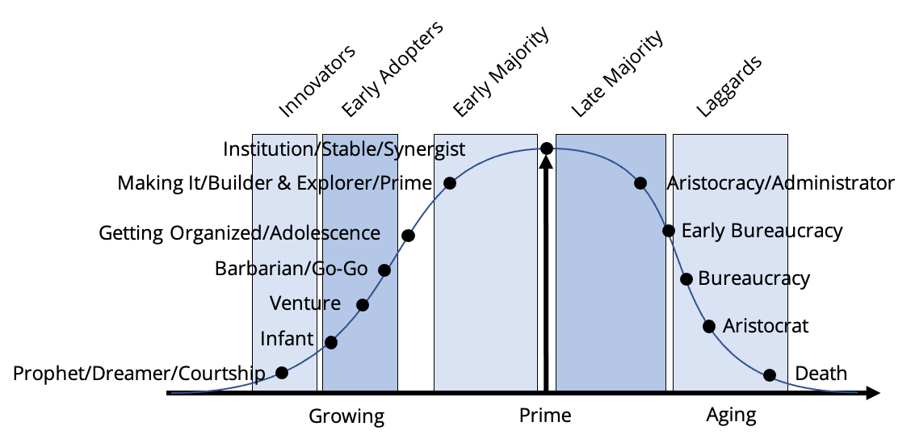

# Simplfying the stages into four characters

Putting all of the dots on the bell curve shows the logical progression of organizational character from birth, through growing, prime, aging, and death. And if you can easily spot the organizational type that you are currently in (or if you in an organization large enough to have multiple characteristics for multiple groups), then that’s great. However, this is a bit complicated and we feel that we can make this whole thing a bit more plug and play.

This entire bell curve can really be split into four quadrants that not only typify the organizational character but give us a more exact way to analyze where your organization fits. By laying four simple boxes over the bell curve, you can see how each of these multiple points can fit into the more generic modes of enthusiast/visionary, pragmatist, conservative, or skeptic. We’ll explain where we got those names in a moment. For now, know that the categorizations can be made much easier, and coming to the conclusion about where your organizational characteristics fit can be more scientific than just pinpointing one of the dots along the growth line.

Remember earlier when we talked about William Bridges using the Myers-Briggs scale for understanding organizations? We’re going to return to that for a quick moment. The Myers-Briggs Type Indicator is used by an industry of professional practitioners to analyze everything from being a mom to running international organizations. The theory is that the psychological “types” of people and organizations can be broken down into a world attitude that is either extraverted (E) or introverted (I). How information is gathered and perceived can be broken down into sensing (S) that leverages the concrete and experiential, or the intuiting (N) that leverages symbolic awareness. How organization, evaluating and judging is handled is either by thinking (T) through the objective assessment of multiple criteria, or through feeling (F) through a subjective assessment based on values and an idea of “worth.” The fourth preference is how the outer world is viewed, which is either through judging (J) as indicated by planning and then following the plan or by perception (P) as indicated by adaptability through keeping options as open as possible. They then link these four preferences together to come up with “type” labels like ENTJ instead of “go-go” or ISFJ instead of “bureaucrat.” And using the work of Linda Berens who organized all of these types into the four boxes we have, we can lay them out and show how they fit within our scheme.

Before you start bellyaching that you think this whole Myers-Briggs thing is a bit too much, don’t worry. We’ve gotten permission from William Bridges to use his questionnaire for our purposes, and we’ve put a self-administered Organizational Character Index online [**HERE**](https://edu.unifiedcompliance.com/mbti/). There are about 30 or so questions there asking bits of information about your organization, such as the couple we’ve listed below:

* Does the organization pay more attention to the demands of its customers or to what it knows how to do best?
* Is the organization better at producing and delivering established products and services, or at planning or creating new ones?
* Are decisions more often made because of market data or because of internal factors such as the beliefs of the leaders or the capacities of the facilities?

The point is, you can use this questionnaire to determine which four-character type you are dealing with, and then it is pretty easy to decide if the team you are working with is in either enthusiast/visionary, pragmatist, conservative, or skeptic mode. **You need to tailor your communications strategy and tactics to the character type of your organization.**

If you haven’t done so, take the survey (it’s a little long, but all questions are necessary) [HERE](https://edu.unifiedcompliance.com/mbti/) and record your four-digit code. You’ll use that code to create and roll out your communications plan.
