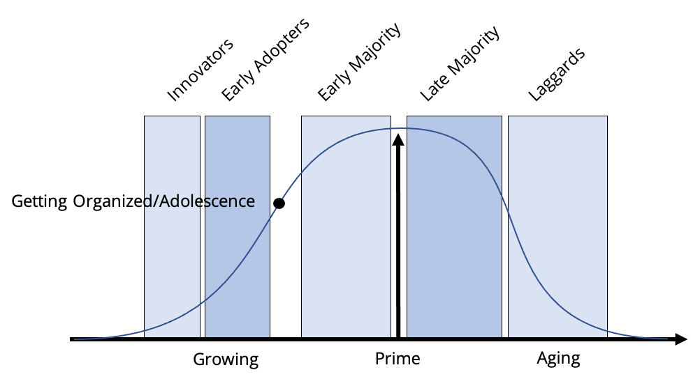

# The Chasm

According to both Miller and Bridges, during this stage, entitled “getting organized” or “adolescence”, companies take a new form. The founders hire chief operating officers but find it difficult to hand over the reins. An attitude of us \(the old-timers\) versus them \(the COO and his or her supporters\) hampers operations. There are so many internal conflicts, people have little time left to serve customers. Companies suffer a temporary loss of vision. Moore points out the huge chasm that separates the early adopters from the early majority. The early adopters are looking for change agents, while the early majority are looking for productivity improvements. The first is looking for revolution and the second evolution. And the two are incompatible. Which fits perfectly with what both Miller and Bridges defined as the leadership style in this chasm – that of discontinuity and conflict – as the leadership is moving from one style to the other. While Geoffrey Moore’s books are about how to cross this chasm, for our purposes we need to understand that an organization can sometimes be in the chasm in terms of its leadership style and developmental state. The problem with trying to deal with compliance during this stage is that the leadership is going through a massive in-fighting campaign with each other. The power asymmetry is swinging from authoritative power to allocative power and compliance programs often fall between the cracks when that happens. The control environment is going to be a dichotomy of both risk taking and risk mitigation, with not a lot of understandability between why some risks are taken and others are mitigated.

## The Main Thing about being in the chasm

Finding someone to champion a compliance program - who can also get budget for it - is going to be tough. This is a tough climate to work in _without_ the overhead of a compliance program. You will probably be stuck with whatever budget, and whatever support, you can scrounge up _locally_, so keep the overhead low.

