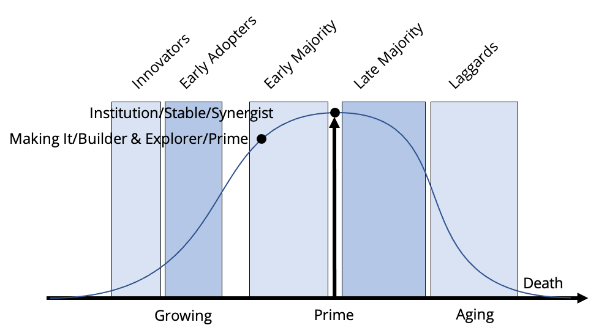

# The Early Majority stage

Miller defines the builder & explorer leadership style as the developers of the specialized skills and structures required for growth, who shift from command to collaboration. Bridges points out the same principles and calls this part of growth as “_making it_”. Adizes calls this time of the organization’s life “_prime_”. His point is that with a renewed clarity of vision (after passing through the chasm), organizations establish an even balance between control and flexibility. Everything comes together. Disciplined yet innovative, organizations consistently meet their customers’ needs. New business lines sprout up within the organization, and they are decentralized to provide new life-cycle opportunities. In the small chasm in between the early majority and the late majority, we find the pinnacle of the organization’s development lifecycle. Miller calls the leader at this point the synergist because the leader has to maintain the balance, and continue the forward motion of a large and complex structure by unifying and appreciating the diverse contribution of the Prophet, Barbarian, Builder, Explorer, and Administrator – all who exist within the larger organization in some fashion. Bridges defines this point of the organization’s development as an institution. Adizes points out in this time of stability that organizations are still strong but without the eagerness of their earlier stages. They welcome new ideas but with less excitement than they did during the growing stages. The financial people begin to impose controls for short-term results in ways that curtail long-term innovation. The emphasis on marketing, research, and development wanes.

Moore points out that the early majority are driven by a strong sense of practicality. They believe in evolution not revolution, so they are not visionaries. Instead, they are interested in making their companies’ systems work effectively. So they are neutral about new projects and look to adopt innovations only after a proven track record of useful productivity improvement, including strong references from people they trust. The leadership style here is either balanced between authoritative and allocative, or it has already begun the shift to allocative.

## The Main Thing about the Early Majority stage

The good news is that the leadership at this point is very pragmatic and therefore will see the practical side of compliance if it is presented well and the budget makes sense.
