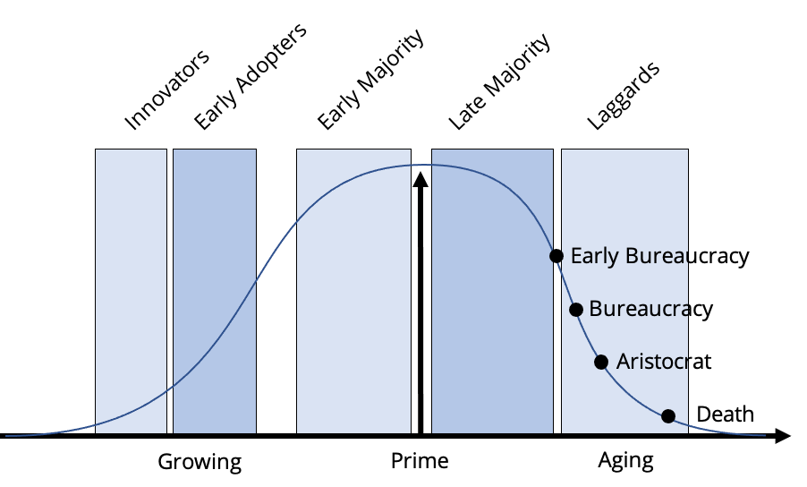

# The Laggard stage

Again, we’ve left the bureaucrats in the breach between the late majority and the laggards to show that they bridge the two lifecycles. Adizes points out that during the full-on bureaucracy that if companies do not die in the previous stage – maybe they are in a regulated environment where the critical factor for success is not how they satisfy customers but whether they are politically an asset or a liability – they become complicated and cumbersome. Procedure manuals thicken, paperwork abounds, and rules and policies choke innovation and creativity. Even customers – forsaken and forgotten – find they need to devise elaborate strategies to get anybody's attention. It is interesting to note that Miller and Adizes have swapped terms here. Adizes put the aristocracy at an earlier stage, and Miller defines the aristocrat here as the inheritor of wealth, alienated from those who do productive work, who is the cause of rebellion and disintegration. Only Adizes points out the stage of death. This final stage may creep up over several years, or it may arrive suddenly, with one massive blow. Organizations crumble when they cannot generate the cash they need; the outflow finally exhausts any inflow. Moore defines the laggards as those who simply don’t want anything to do with new projects. They are not so much potential customers of anything new within the organization as they are ever-present critics of it. As such, the goal of the compliance manager is not to engage them but rather to work around them, and ensure that they don’t have a chance to block forward movement.

## The Main Thing about the Laggard stage

Their relationship to compliance is the same to anything that is bureaucratic – it fits their weltgeist and they understand it. To this leadership group, compliance is simply one more set of rules to add to the already over-sized policy books. The control environment is almost completely allocative based and extremely bureaucratic.
