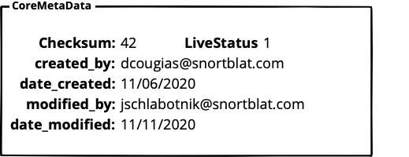

# Converting JSON-LD into database structures

If the JSON-LD schema is written correctly, you can create a system to interpret the schema and create a table map of the schema. To prove this theory, we’ve created an open **Filemaker** addon that you can freely add to _any_ Filemaker database to do just that.

Let’s go through the process. We will start with a very simple schema, _Currency_, as documented at [https://grcschema.org/Currency](https://grcschema.org/Currency).

## Recording the structure

Even though obvious, the first place you’ll need to start is gathering the schema data itself. Websites such as Schema.org and GRCSchema.org have well-defined JSON-LD schemas. Below is the _Currency_ schema from GRCSchema.org.


Normally, websites such as these have various options of looking at the schema, such as this one that presents **schema**, **structure**, and **visualized**. You can skip any visualization, and the structure view provides more information than you’ll need. So we’ll go with the sample schema, as shown here:

```text
{
 "@context": "http://grcschema.org/",
 "@type": "Currency",
 "CoreMetaData": {
 "@type": "CoreMetaData",
 "date_created": "Date",
 "date_modified": "Date",
 "created_by": "Integer",
 "modified_by": "Integer",
 "live_status": "Boolean",
 "checksum": "Integer",
 "validated": "Boolean"
 },
 "CurrencyCodes": {
 "@type": "CurrencyCodes",
 "@set": [
 {
 "@type": "CurrencyCode",
 "id": "Integer",
 "currency_code": "String",
 "currency_fk": "Integer"
 }
 ]
 },
 "CurrencyCountries": {
 "@type": "CurrencyCountries",
 "@set": [
 {
 "@type": "CurrencyCountry",
 "name": "String",
 "id": "Integer",
 "country_fk": "Integer",
 "currency_fk": "Integer"
 }
 ]
 },
 "CurrencyNames": {
 "@type": "CurrencyNames",
 "@set": [
 {
 "@type": "CurrencyName",
 "id": "Integer",
 "currency_name": "String",
 "currency_fk": "Integer"
 }
 ]
 },
 "CurrencySymbols": {
 "@type": "CurrencySymbols",
 "@set": [
 {
 "@type": "CurrencySymbol",
 "id": "Integer",
 "currency_symbol": "Char",
 "currency_fk": "Integer"
 }
 ]
 },
 "id": "Integer"
}
```

## Creating the tables and fields to hold the data

If you are going to write an interpreter, you’ll want a minimum of three fields:

1. Schema – this will hold the schema you are going to work with.
2. Non-nested schema – this will hold a translation of the schema into a simple JSON array.
3. DB tables – this will hold a list of all of the database tables you’ll need to create.

## The methodology

We explain the methodology for each step below. The methodology uses a custom _While_ function to step through each line of the schema that repeats logic while the condition is true, then returns the result. The format of the _While_ function is shown below:

While \( \[ initialVariable \] ; condition ; \[ logic \] ; result \)

The parameters for the While function are:

* **initialVariable** - variable definitions that will be available to use in the following parameters.
* **condition** - a Boolean expression evaluated before each loop iteration. While True, the loop repeats. When False, the loop stops.
* **logic** - variable definitions that are evaluated each time the loop is repeated.
* **result** - an expression that is returned when the loop stops.

### The initial variables

Below we will show all the initial variable setups we are using and explain each.

| **Initial Value** | **Explanation** |
| :--- | :--- |
| ~json = json; | This is just taking the json passed in and putting in into a local variable for readability. |
| ~path = path ; | Take the json path string and put it into a local variable for readability. |
| ~extendedPath = Case \( IsEmpty \( ~path \) ; "" ; ~path & "." \) ; | Add a dot to the string for passing into next pass of recursion, unless string was not passed in. |

Now we need a few loop control variables.

| **Initial Value** | **Explanation** |
| :--- | :--- |
| ~keys = JSONListKeys\(~json ; ""\); | This calls a standard function to get our list of JSON keys from the object. |
| ~keyCount = Case\(Left\(~keys ; 1\) = "?" or IsEmpty \(~keys\) ; 0 ; ValueCount \(~keys\)\); | Get the count of the keys for looping. |
| ~n = 1 ; | This is the loop control variable. |

Now we need to add a few more to initialize variables that are reset during each loop iteration.

<table>
  <thead>
    <tr>
      <th style="text-align:left"><b>Initial Value</b>
      </th>
      <th style="text-align:left"><b>Explanation</b>
      </th>
    </tr>
  </thead>
  <tbody>
    <tr>
      <td style="text-align:left">~thisKey = &quot;&quot;;</td>
      <td style="text-align:left">The current key we are on.</td>
    </tr>
    <tr>
      <td style="text-align:left">~thisValue = &quot;&quot;;</td>
      <td style="text-align:left">The current value associated with the current key.</td>
    </tr>
    <tr>
      <td style="text-align:left">~isTable = &quot;&quot;;</td>
      <td style="text-align:left">Boolean indicating whether the current key is a table name.</td>
    </tr>
    <tr>
      <td style="text-align:left">~isSet = &quot;&quot;;</td>
      <td style="text-align:left">Boolean indicating whether the current value is a @set array.</td>
    </tr>
    <tr>
      <td style="text-align:left">~isArrayElement = &quot;;</td>
      <td style="text-align:left">Boolean indicating whether the current value is an element of an indexed
        array.</td>
    </tr>
    <tr>
      <td style="text-align:left">~isJSON = &quot;&quot;;</td>
      <td style="text-align:left">Boolean indicating whether the current value is a JSON object.</td>
    </tr>
    <tr>
      <td style="text-align:left">~result = &quot;&quot;</td>
      <td style="text-align:left">The result which will eventually be passed out of the function.</td>
    </tr>
    <tr>
      <td style="text-align:left">~fields = &quot;&quot; ;</td>
      <td style="text-align:left">The fields in the current table.</td>
    </tr>
    <tr>
      <td style="text-align:left">~extendedPath = Case ( IsEmpty ( ~path ) ; &quot;&quot; ; ~path &amp;
        &quot;.&quot; ) ;</td>
      <td style="text-align:left">The full path of the table, including parent tables, separated by periods
        &#x201C;.&#x201D;.</td>
    </tr>
    <tr>
      <td style="text-align:left">~pathList = Substitute ( ~path ; &quot;.&quot; ; &#xB6; ) ;</td>
      <td style="text-align:left">A list of all of the paths.</td>
    </tr>
    <tr>
      <td style="text-align:left">~lastInPath = GetValue ( ~pathList ; ValueCount ( ~pathList ) ) ;</td>
      <td
      style="text-align:left">The very last line of the path list.</td>
    </tr>
    <tr>
      <td style="text-align:left">
        <p>~thisTable = Case (</p>
        <p>IsEmpty ( ~path ) and Left ( JSONGetElement ( ~json ; &quot;@set&quot;
          ) ; 1 ) &#x2260; &quot;?&quot; ; JSONGetElement ( ~json ; &quot;@type&quot;
          );</p>
        <p>not IsEmpty ( JSONGetElement ( ~json ; &quot;@set&quot; ) ) and Left (
          JSONGetElement ( ~json ; &quot;@set&quot; ) ; 1 ) &#x2260; &quot;?&quot;
          ; JSONGetElement ( ~json ; &quot;@type&quot; ) ;</p>
        <p>GetValue ( ~pathList ; ValueCount ( ~pathList ) )
          <br />) ;</p>
      </td>
      <td style="text-align:left">The current table being examined during this function&#x2019;s run.</td>
    </tr>
    <tr>
      <td style="text-align:left">
        <p>~parentTable = Case (</p>
        <p>IsEmpty ( ~lastInPath ) ; &quot;&quot; ;</p>
        <p>~lastInPath = ~thisTable and ValueCount ( ~pathList ) &gt; 1 ; GetValue
          ( ~pathList ; ValueCount ( ~pathList ) - 1 ) ;</p>
        <p>~lastInPath = ~thisTable ; &quot;&quot; ;</p>
        <p>~lastInPath</p>
        <p>) ;</p>
      </td>
      <td style="text-align:left">The current table&#x2019;s parent.</td>
    </tr>
    <tr>
      <td style="text-align:left">
        <p>~thisPath = Case (</p>
        <p>~parentTable = ~thisTable; ~path ;</p>
        <p>~path = ~thisTable ; ~path ;</p>
        <p>~lastInPath = ~thisTable ; ~path ;</p>
        <p>~extendedPath &amp; ~thisTable</p>
        <p>) ;</p>
      </td>
      <td style="text-align:left">The current table&#x2019;s path.</td>
    </tr>
    <tr>
      <td style="text-align:left">
        <p>~baseJSON = JSONSetElement ( &quot;&quot; ;</p>
        <p>[ &quot;table&quot; ; ~thisPath ; JSONString ]</p>
        <p>)</p>
      </td>
      <td style="text-align:left">The heading of each of the resulting arrays. This could also include parent
        table and other information.</td>
    </tr>
  </tbody>
</table>

### The condition logic

The condition logic for this is pretty simple. Keep looping through the json text until you get to the last line.

~n ≤ ~keyCount ;

### The logic used for interpretation

The logic used for the interpretation is based off of what we find in each row of the json being passed. Each of the main things to draw from the JSON are described below.

#### Handling of the loop iterations

<table>
  <thead>
    <tr>
      <th style="text-align:left"><b>Value</b>
      </th>
      <th style="text-align:left"><b>Explanation</b>
      </th>
    </tr>
  </thead>
  <tbody>
    <tr>
      <td style="text-align:left">
        <p>~thisKey = GetValue ( ~keys ; ~n ) ;</p>
        <p>~thisValue = JSONGetElement ( ~json ; ~thisKey ) ;</p>
        <p>~isTable = Left ( JSONGetElement ( ~thisValue ; &quot;@set&quot; ) ; 1
          ) &#x2260; &quot;?&quot; and not IsEmpty ( JSONGetElement ( ~thisValue
          ; &quot;@set&quot; ) ) ;</p>
        <p>~isSet = ~thisKey = &quot;@set&quot; ;</p>
        <p>~isArrayElement = IsEmpty (</p>
        <p>Substitute ( ~thisKey ;</p>
        <p>[ 0 ; &quot;&quot; ] ;</p>
        <p>[ 1 ; &quot;&quot; ] ;</p>
        <p>[ 2 ; &quot;&quot; ] ;</p>
        <p>[ 3 ; &quot;&quot; ] ;</p>
        <p>[ 4 ; &quot;&quot; ] ;</p>
        <p>[ 5 ; &quot;&quot; ] ;</p>
        <p>[ 6 ; &quot;&quot; ] ;</p>
        <p>[ 7 ; &quot;&quot; ] ;</p>
        <p>[ 8 ; &quot;&quot; ] ;</p>
        <p>[ 9 ; &quot;&quot; ]</p>
        <p>)</p>
        <p>) ;</p>
      </td>
      <td style="text-align:left">These values are here for handling the various aspects of the loop iteration.</td>
    </tr>
    <tr>
      <td style="text-align:left">~isJSON = Left ( JSONFormatElements ( ~thisValue ) ; 1 ) &#x2260; &quot;?&quot;
        and not IsEmpty ( ~thisValue ) ;</td>
      <td style="text-align:left">If there is nothing but numerical digits, assume we&#x2019;ve got a number.</td>
    </tr>
    <tr>
      <td style="text-align:left">
        <p>~nextIteration = Case (</p>
        <p>~isJSON ; ConvertToNonNestedJSON ( ~thisPath ; ~thisValue ) ;</p>
        <p>//else</p>
        <p>&quot;&quot;</p>
        <p>) ;</p>
      </td>
      <td style="text-align:left">If we are going to have a next iteration, go ahead and get it.</td>
    </tr>
    <tr>
      <td style="text-align:left">
        <p>~nextIterationFields = Case (</p>
        <p>~isJSON; ConvertToNonNestedJSON ( ~thisPath ; ~thisValue ) ;</p>
        <p>&quot;&quot;</p>
        <p>) ;</p>
        <p>~fields = Case (</p>
        <p>not IsEmpty ( ~nextIterationFields ) ;</p>
        <p>Let ( [</p>
        <p>~error1 = Left (JSONFormatElements ( ~fields ) ; 1 ) &#x2260; &quot;[&quot;
          and not IsEmpty ( ~fields ) ;</p>
        <p>~error2 = Left (JSONFormatElements ( ~nextIterationFields ) ; 1 ) &#x2260;
          &quot;[&quot; and not IsEmpty ( ~nextIterationFields );</p>
        <p>~combinedArrays = Left ( ~fields ; Length ( ~fields ) - 1 ) &amp; &quot;,&quot;
          &amp; Right ( ~nextIterationFields ; Length ( ~nextIterationFields ) -
          1 )</p>
        <p>];</p>
        <p>Case (</p>
        <p>~error1 or ~error2 ; &quot;error&quot; ;</p>
        <p>IsEmpty ( ~fields ) ; ~nextIterationFields ;</p>
        <p>IsEmpty ( ~nextIterationFields ) ; ~fields ;</p>
        <p>~combinedarrays</p>
        <p>)</p>
        <p>) ;</p>
        <p>Let ( [</p>
        <p>#theArray = Case (</p>
        <p>IsEmpty ( ~fields )</p>
        <p>or</p>
        <p>~fields = &quot;{}&quot; ; &quot;[]&quot; ;</p>
        <p>~fields</p>
        <p>) ;</p>
        <p>#index = Case ( IsEmpty ( ~fields ) ; 0 ; ValueCount ( JSONListKeys (
          ~fields ; &quot;&quot; ) ) ) ;</p>
        <p>#error = Case ( Left ( #index ; 1 ) = &quot;?&quot; ; &quot;Invalid Array&quot;
          ) ;</p>
        <p>#thisField = JSONSetElement ( ~baseJSON ;</p>
        <p>[ &quot;field&quot; ; ~thisKey ; JSONString ] ;</p>
        <p>[ &quot;type&quot; ; ~thisValue ; JSONString ]</p>
        <p>)</p>
        <p>];</p>
        <p>Case (</p>
        <p>~thisKey = &quot;@type&quot; or ~thisKey = &quot;@context&quot; ; ~fields
          ;</p>
        <p>JSONSetElement ( #theArray ; #index ; #thisField ; JSONObject )</p>
        <p>)</p>
        <p>)</p>
        <p>);</p>
      </td>
      <td style="text-align:left">Get any fields passed back by the next iteration. The result is passed
        back as json with lines and fields keys.</td>
    </tr>
  </tbody>
</table>

#### Interpreting @type as a table name

The second element of the JSON-LD schema should be the @type keyword. The @type keyword as the second element in the schema represents the primary table name that should be created. It is linked to the schema by a project ID.

Therefore, there is no special code necessary to determine the primary table name.

For every field in the primary table, this information will be stored in the field **parent\_table**.

#### Interpreting "@set": \[ at the top level as an array

If, at the primary level an @set keyword is found, that denotes what follows will be returned as an array of information with each of the keys denoting the individual fields within the array.

While _Currency_ doesn’t have this pattern, the JSON for returning the stub-list of _all_ _Currency_ records does \(see [https://grcschema.org/Currencies](https://grcschema.org/Currencies)\).

{

 "@context": "http://grcschema.org/",

 "@type": "Currencies",

 "@set": \[

 {

 "country\_fk": "Integer",

 "id": "Integer",

 "name": "String"

 }

 \]

}

The _properties_ are then used to create the field names \(**field\_name**\) in our Fields table. The **field\_type** is derived from the element’s _type_.

Your system should then go through each of the element’s keys and create records in your **Fields** table, as shown below:

| **parent\_table** | **sub\_table** | **field\_name** | **field\_type** |
| :--- | :--- | :--- | :--- |
| Currencies |  | country\_fk | Integer |
| Currencies |  | id | id |
| Currencies |  | name | String |

#### Interpreting "propertynamegoeshere" : { as an object

Within our example of _Currency_, you can see that the 4th line of the schema text is:

"CoreMetaData" : {

This pattern represents a grouped _object_. In many databases \(ours included\) the fields of the grouped object are treated as any other field and the is recorded _as an object_ but not turned in to a field in-and-of itself.

In layouts, however, grouped objects are represented as a _field set_, as shown below:



#### Interpreting "propertynamegoeshere": { "@set": \[ as a subtable

In the example below we can see that within _Currency_, right after _CoreMetaData_ we have a subtable of _CurrencyCodes_ that follow this pattern.

"CurrencyCodes": {

 "@set": \[

 {

 "id": "Integer",

 "currency\_code": "String",

 "currency\_fk": "Integer"

 }

 \]

 },

That’s our cue that each currency can be assigned multiple currency codes. And hence, a subtable should be created. Another hint, by the way, is that the array shows both an **id** property and a **currency\_fk** property so that the two tables can be linked together.

In filling out our interpretation database, CurrencyCodes becomes subtable and also tells us that each of the fields below it belong to _it_.

| **parent\_table** | **sub\_table** | **field\_name** | **field\_type** |
| :--- | :--- | :--- | :--- |
| Currency | CurrencyCodes | id | Integer |
| Currency | CurrencyCodes | currency\_code | String |
| Currency | CurrencyCodes | currency\_fk | Integer |

This allows us to create a table structure that links the Currency table to its subtable CurrencyCodes, as shown below:


### The result is a simple JSON array of fields, tables, and field types

What results is an array of each of the fields with its table, object identifier \(optional\), and the field type, as shown below:

```text
{
 "field" : "checksum",
 "object" : "CoreMetaData",
 "table" : "Currency",
 "type" : "Integer"
},
```

Once you have converted the JSON-LD into this simple array, you can easily create scripts to re-intrepret the array into SQL table commands, like the one shown below:

```text
CREATE TABLE "Currency" (
"checksum" int,
"created_by" int,
"date_created" date,
"date_modified" date,
"live_status" int,
"modified_by" int,
"validated" int,
"id" int
)
```

## Sample files

We have some sample files to help you through this.

ConvertToNonNested.txt – this is the custom function described above.

SchemaToTableConverter.fmp12 – this is a Filemaker database that is completely open and takes you through each of the steps we’ve described above.

