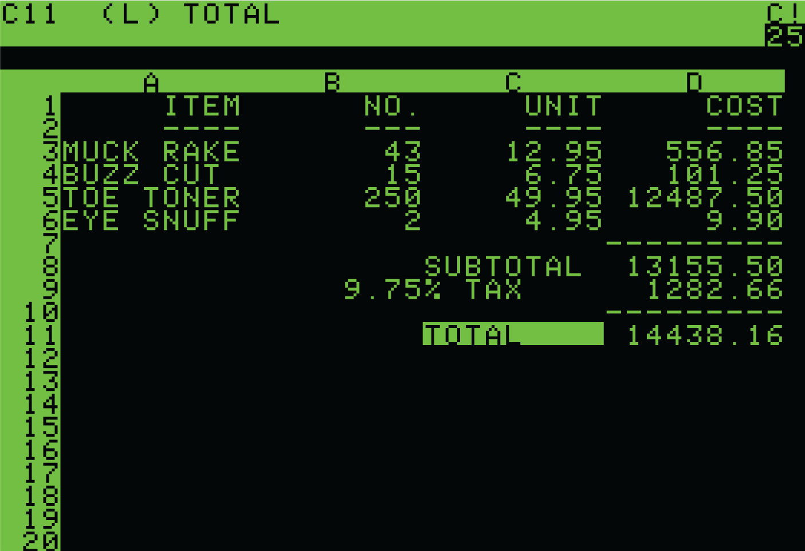
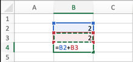
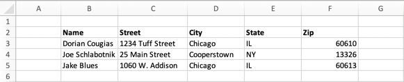
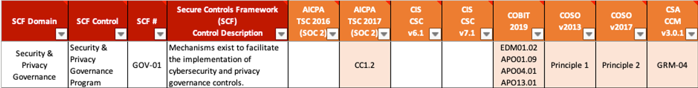

# Tutorial A quick history from documents to databases

### Tutorial: A quick history from documents to databases 

Until 1979, the term structured data was not part of most of our language. It was the realm of programmers in white coats in laboratories. Then Dan Bricklin launched VisiCalc. VisiCalc (short for "visible calculator") was the first spreadsheet computer program for personal computers, originally released for the Apple II by VisiCorp. Why do I mention this? Because he introduced us to **cells**, **rows**, and **columns**. Until then, we only had text on a screen for the masses.

#### Documents to Workbooks

Prior to Visicalc, writing to an electronic file meant writing to a **document**. Period. If you wanted to explain a mathematical formula, you wrote it in text in a document. If you wanted to have a list of addresses, you typed them into a document. There was no separation of _values_ and open text. With the advent of VisiCalc and then its successor Lotus 1-2-3 (then Excel, Google Sheets, Numbers, etc.), **workbooks** evolved to segregate data into discreet values.

.png>)

Values in Cells and Rows and Columns (oh my!)

With the advent of spreadsheets, we could segregate data into specific **values**. For the first time, 2 + 2 = 4 could be expressed as three distinct values (2, 2, and the calculation of n + n equaling a value).

**Values in Cells**

A **cell** contains a single data value. As we all know from using spreadsheets, a cell can contain data _or_ a calculation.

**Values in Rows**

A horizontal _string_ of cells is a **row**.

**Values in Columns**

A vertical _string_ of cells is a **column**.

**Tables**

A _string_ of rows and columns, in a quadrant, is a **table**. While not _necessary_, tables typically name each of the columns in the table. Some will name the rows, though we don't show that in our example below.

#### Visualizing the table above as a data model 

If you were to turn the first two columns of the table above into a data model, you'd have to diagram it as follows where each column has one to many relationships, and each row has a one-to-one relationship.

This becomes problematic because many of the frameworks, such as spreadsheets and tables, don't follow this data model. We will cover this in more depth below.

#### Uses and limitations 

Each cell can be named and manipulated _individually_ or _collectively_ as a row, column, or even table. And, of course, limitations become quickly evident. First in size, then in complexity.

**Limitations of size**

When you first open a spreadsheet, there's a default number of rows and columns built-in. For example, Google Sheets starts with 26 columns and 1,000 rows.

Because there are only 26 letters in the alphabet, spreadsheet programs need a way to place a value on a column beyond No. 26 (Column Z). To do this, column names are typically appended with the start of the alphabet again. For example, Row 27 might read AA, Row 28 AB, and so on.

However, most programs limit the number of rows and columns in a spreadsheet. Google Sheets, for example, allows you to make no more than 18,278 columns, but there's no limit on rows. Excel worksheets are limited to 16,384 columns and 1,048,576 rows.

In Excel, the very last column heading is called XFD to indicate Column 16,384.

One of our data structures within the Unified Compliance Framework has 42 million rows.

**Limitations of complexity**

Tables are _great_ when you can put information into neat columns and rows. But they immediately break when you want to nest columns inside of rows. Let's take that table above and reimagine it with multiple addresses for one of the records.

Think of this table as _two_ tables, an overall table of names and addresses, with a nested table of _just_ addresses (and their types). Why is this important? Because the simple table phenomenon for frameworks breaks as soon as a one-to-many relationship is established, such as the one shown here in the SCF spreadsheet where SCF's GOV-01 is mapped to multiple CobiT 2019 Citations, shown below.

#### Names separated from Values and tables connecting to tables 

Databases evolved from spreadsheets. They overcome both limitations of size and complexity. Databases transform cells into **fields**. Each of those fields is _named_ so that you have both a **name** and **values** combined in each field. In the example below, we transposed the spreadsheet into a defined table with field names (left) and the field contents (right).

.png>)

Databases transform horizontal strings of fields into **rows**.

.png>)

Databases transform vertical strings of rows into a **table**.

.png>)

Databases allow connecting one table to nested or related tables.

.png>) .png>)

Let's recap where we are. We now have:

.png>)

* **Names** – We can name cells, columns, rows, or database fields and tables and separate that from values.
* **Values** – We can express individual values, whether in cells or fields.
* **Rows or Records** – We can express horizontal strings of named values as rows or records.
* **Columns and Arrays and Tables** – We can express vertical strings of named values as columns, arrays, or tables.
* **Nested Arrays in Tables** – We can express the nesting of arrays or whole tables within tables.

|                             | **Spreadsheet**       | **Database**          |
| --------------------------- | --------------------- | --------------------- |
| **Names**                   | <ul><li>Yes</li></ul> | <ul><li>Yes</li></ul> |
| **Values**                  | <ul><li>Yes</li></ul> | <ul><li>Yes</li></ul> |
| **Rows or Records**         | <ul><li>Yes</li></ul> | <ul><li>Yes</li></ul> |
| **Columns, Arrays, Tables** | <ul><li>Yes</li></ul> | <ul><li>Yes</li></ul> |
| **Nested Arrays in Tables** | <ul><li>No</li></ul>  | <ul><li>Yes</li></ul> |

These concepts will play a big part in the rest of our discussion revolving around JSON and why spreadsheets suck.

## The discovery of JSON and how it is different than databases

Douglas Crockford, a former Atari employee, discovered JSON in 2000 while working as CTO at State Software, wherein he coined the term and formalized its syntax and registered the domain JSON.org. In July 2006, Crockford standardized JSON'S grammar on RFC 4627, which further defined JSON's composition. Its internet media type is application/JSON, and its file extension is .JSON when saved. JSON was formally acknowledged as an ECMA standard with ECMA-404.

JSON-LD was co-created by Dave Longley, Gregg Kellogg, Markus Lanthaler, and Many Sporny in 2010. It is designed around the concept of a "context" to provide additional mappings from JSON to a Resource Description Framework (RDF model).

JSON and JSON-LD are not alternative languages for maintaining a relational database. Their use is for _representing_ data coming out of, or going back into, databases.

### **Difference in structure**

Databases use tables to store data in columns (fields) and rows (records), as explained above.

JSON uses objects – the equivalent of columns & fields, that can be nested (the equivalent of rows & records) recursively. We will cover JSON's object key-value pair below and how it handles arrays.

### **Data interchange**

Databases use Structured Query Language (SQL) to search, retrieve, and input data. SQL is insanely robust for all three interchange aspects just noted. JSON has no equivalent of any of the three. While a database can use SQL to query another database, any system using JSON must work through an intermediary Application Programming Interface (API) to achieve the same ends.

### **Metadata**

Databases use metadata within their schema to store information about the database's data structure. JSON-LD, _in particular_, uses the Linked Data portion to define the type and structure of the represented data.
