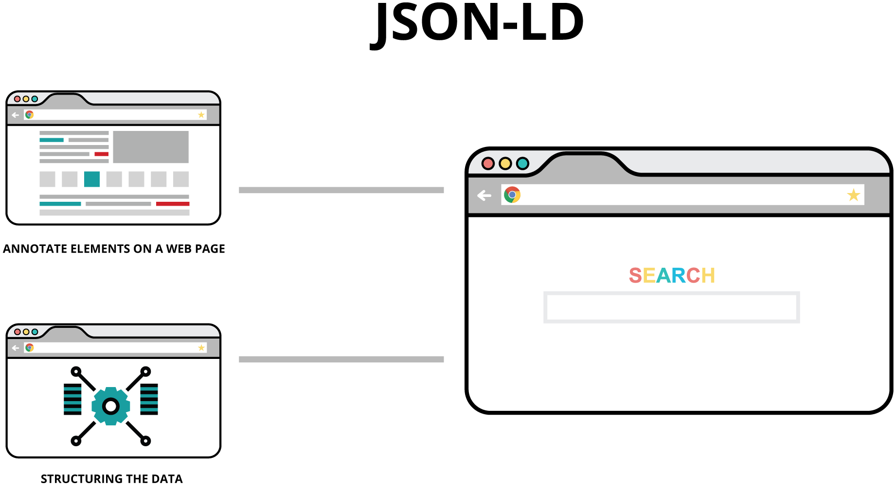

# Tutorial: from databases to JSON-LD

Databases are great. However, no-one is going to let you connect directly with their database to share data. We aren’t going to spend any time on all of the ways in which data have been shared between databases \(EDI, XML, direct API queries\); the answer _today_ is JavaScript Object Notation.

JavaScript Object Notation, JSON from here on out, has a small, well-defined and logical set of rules, enabling you to encode, store and retrieve structured data in a format that is easily readable by both humans and machines. It has become _**the**_ ****data exchange format on the Web, and if you aren’t already working with it, you _will_ be working with it when communicating your compliance framework.

## The structure of JSON

JSON has only two structures; objects and arrays. _Everything_ in JSON is either an object or an array. And more importantly, objects can have embedded objects as well as embedded arrays. And arrays can have embedded objects. _Way cool_.

To explain this, we’ll go back to a couple of the tables from above; a simple name table \(left\) and a complex name/address table \(right\):

 

### Object syntax

The properties of every JSON object are derived from three elements:

* * Key – think _field name_ or _table name_ here.
  * Value – this is the _content_ of the field, and is left blank for an object or array.
  * Type – this describes one of three things: an object, an array, or the field type for the content.

JSON turns the combination of _keys_ and _values_ into a **property**, which are paired together separated by a colon in a JSON Object. This is also called the key:value pair, where the property name is expressed then the property value "property name": "property value".

This is more easily understood once you start adding content to a JSON file. Let’s start with a blank one, below:

The _Root_ object in JSON is always described as a simple pair of curly brackets “{ }”. At this point, there are no keys, no values, and no defined types.

To this, we are going to add the various types of content.

### Writing Objects

Objects \(think a single record in a table even if it only has one field\), are surrounded by curly brackets “{ }” to denote that everything inside of the brackets is a single object, that consist of _strings_ of comma-separated key:value pairs \(pairings of keys and then their values separated by colons\). Here’s the first row of the name table in JSON.

In tree format, the object looks like this:

In JSON format, it looks like this, where each of the fields in the tree is returned as a new line ending in a comma. The key \(field name\) always precedes the value \(field contents\):

The _type_ isn’t presented in basic JSON code \(we’ll get to that as a part of JSON-LD in a bit\).

### Arrays

Simple arrays, as a JSON type, are surrounded by square brackets “\[ \]” and consist of comma-separated values. If you wanted to present the column of three numbers as we did in the spreadsheet, it would be expressed as a simple array. In tree format, the simple array looks like this:

In JSON format, it looks like this, with the account number split from the account name.

That won’t work well to create a table. And this is where objects as a _type_ come in to play. If we re-arrange the tree to add a set of object brackets “{ }”, we can then add the key to the property and display each of the name records with their individual fields in the array:

Now the JSON structure will separate each record and display the key/value pair for each record in the array:

Very clearly this JSON tells us that this _table_ is called **Names** and it has two fields \(keys\) named **Acct:** and **Name**.

## Complex Object Arrays

Now that we understand objects and arrays, let’s go back to that name and address table and put both of them together. When finished, what we want is:

* * an array of names; and
  * an array of addresses _for each name_.

So we build out a tree that looks like the one that follows:

With this, the JSON structure embeds an array for each name and then embeds another array _within that one_ for each address.

While this is great stuff, there isn’t yet enough information to tell a developer how to automatically translate this into a database structure. Remember that basic JSON doesn’t even pass along the key/value _type_.

We must turn to JSON-LD for more information.

## Adding structured and linked data to JSON

There is no doubt that JSON is the shareable language that all systems are currently using to share data back and forth. However, there was no standardized methodology to share JSON with the ubiquitous web browsers that _everyone_ uses to communicate.

In 2011, Google, Bing, Yahoo!, and Yandex created a joint effort to unify a structured data vocabulary for the web and the output was twofold; JavaScript Object Notation for Linked Data \(JSON-LD\) and the vocabulary repository for it at Schema.org[\[1\]]().

The initial goal for JSON-LD was to annotate elements on a web page, structuring the data, which can then be used by search engines to disambiguate elements and establish facts surrounding entities, which is then associated with creating a more organized, better web overall[\[2\]]().

### The Context

The first element that retains a permanent place in JSON-LD markup is the @context with the value of the schema URL you are going to use. Currently there are two known schemas that support compliance frameworks, [http://schema.org](http://schema.org/) and [https://grcschema.org](https://grcschema.org/). In tree view, the context is laid out as an array of information.

One thing to notice here in JSON-LD is the wealth of information _about the data structure_ that is also passed to the reader! The rdfs:labels tell give you the object name while the rdfs:comment gives you the information _about_ the object you are dealing with.

#### The Type

The second element in the JSON-LD Schema “always there” squad is the @type specification \(after the colon, it becomes all data annotation\). @type specifies the item type being marked up. All Types have as their top level, _Thing_ as shown below:

#### Schema Properties

Within JSON-LD, each object’s properties are described in-depth. Below we present the property for _first\_name_ and are able to tell the reader that this is _text_ element and, in the comments, that it represents a person’s first name.

#### Schema Arrays

In addition to standard schema properties, JSON Context can also tell the reader that what is being presented is an array. In the example below, the _person_ object allows for an array of additional e-mail addresses. This is described, in JSON-LD Context, as a set \(“@set”\):

By labelling each type of thing in a JSON object, you can provide the necessary code to developers to create structured pages that use either Microdata or RDF to tag HTML tag attributes that correspond to the user-visible content that you want to describe.

### Endnotes

1.  Although Schema.org is only one of the JSON-LD repositories as we’ll see later on. Organizations such as NIST have their own model maps \(“Catalog JSON Model Map” n.d.\) and so does GRCschema.org \(which we’ll be working with. [↑]()
2.  \(“A Guide to JSON-LD for Beginners” n.d.\) [↑]()

